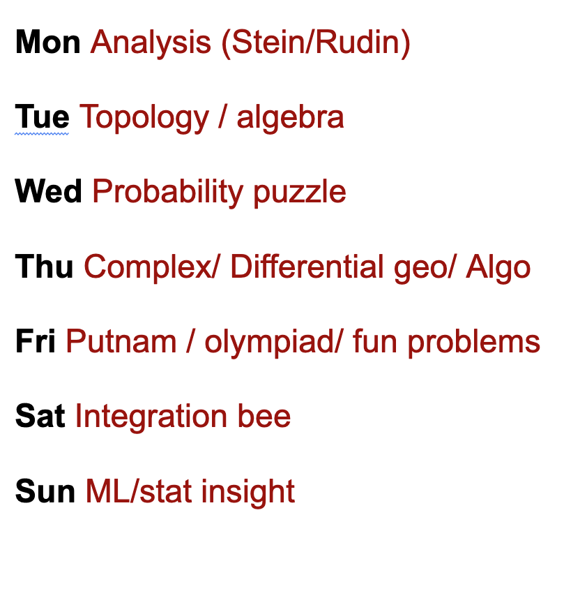
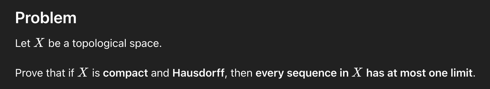
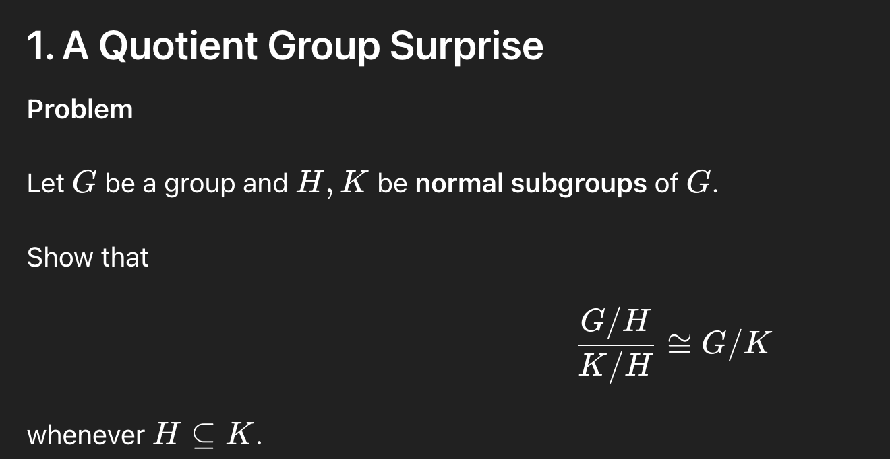

# Daily Brain Teaser

> Auto-synced from Notion. Last updated: 2026-03-15 06:53 UTC

## Problem Schedule

## Welcome

This is a personal collection of small but beautiful mathematical problems — one a day, organized by topic.
Problems come from Putnam, olympiads, probability puzzles, integration bees, complex analysis, differential geometry, ML/stats, and more.

**Contributions and feedback are welcome!** Feel free to open an issue or PR if you have a problem to suggest, a cleaner solution, or a correction.

---

## Problem List

| # | Name | Type | Date | Redo | Solved | Preview | Question | Answer | Related | Comments |
|---|------|------|------|------|--------|---------|----------|--------|---------|----------|
| 1 | Integral of a Geometric Series |  | 2026-03-14 |  | ✅ |  | [view](questions/geometric_series_integral/question.md) | [view](questions/geometric_series_integral/answer.md) |  | not super difficult |
| 2 | Harmonic Series Is Never an Integer |  | 2026-03-13 |  |  |  | [view](questions/harmonic_not_integer/question.md) | [view](questions/harmonic_not_integer/answer.md) |      | very interesting question, prime related |
| 3 | Polynomial with No Integer Roots |  | 2026-03-13 |  |  |  | [view](questions/polynomial_no_integer_roots/question.md) | [view](questions/polynomial_no_integer_roots/answer.md) |   | semi solved by my own, had steps not most strict, also used hint |
| 4 | Parallel Transport on a Sphere |  | 2026-03-13 |  |  |  | [view](questions/parallel_transport_sphere/question.md) | [view](questions/parallel_transport_sphere/answer.md) |  | didn't understand much |
| 5 | schwarz lemma |  | 2026-03-12 |  |  |  | [view](questions/schwarz_lemma/question.md) | [view](questions/schwarz_lemma/answer.md) |  |  |
| 6 | Bertrand's Ballot Problem |  | 2026-03-11 |  |  |  | [view](questions/bertrand_ballot/question.md) | [view](questions/bertrand_ballot/answer.md) |   | need tricks to solve, a lot of tricks |
| 7 | Expected Number of Records |  | 2026-03-11 |  |  |  | [view](questions/expected_records/question.md) | [view](questions/expected_records/answer.md) |    | same exact question in ICMT, very interesting, redo needed |
| 8 | compact + hausdorff = unique limit |  | 2026-03-10 |  |  |  |  | [link](https://chatgpt.com/g/g-p-69abc8db02c08191826dfb3a4713af23/c/69afdb46-ebf4-832c-bac0-09f05fa2c12c) |    | interesting small question |
| 9 | third isomorphism thm |  | 2026-03-10 |  |  |  |  | [link](https://chatgpt.com/g/g-p-69abc8db02c08191826dfb3a4713af23-math-problem-picker/c/69afb39a-4a88-832b-93ae-e6b5c27b462e?tab=sources) |  | didn’t understand the answer, need redo |
| 10 | Lp norm → infinity |  | 2026-03-09 |  |  |  |  | [link](https://chatgpt.com/g/g-p-69abc8db02c08191826dfb3a4713af23-math-problem-picker/c/69ae7a52-c2e8-832a-9db9-9a3dbf5ed948) |     | interesting problem: 分析基本功 |
| 11 | polynomial approximate cont |  | 2026-03-09 |  |  |  |  | [link](https://chatgpt.com/g/g-p-69abc8db02c08191826dfb3a4713af23-math-problem-picker/c/69ae7064-5110-832c-b48e-4fc727266cd8?tab=chats) |       | Every interesting discussion in the answer part. Worth checking again |
| 12 | why model over/under fit |  | 2026-03-08 |  |  |  |  | [link](https://chatgpt.com/g/g-p-69abc8db02c08191826dfb3a4713af23-math-problem-picker/c/69ad1cd2-87e0-8326-bd51-67d7ba6f5b9a) |  | very interesting and deep question, need to redo |
| 13 | gradient = prediction - truth |  | 2026-03-08 |  |  |  |  | [link](https://chatgpt.com/g/g-p-69abc8db02c08191826dfb3a4713af23-math-problem-picker/c/69ad1879-9d48-8328-b48f-f068899f7ae5?tab=sources) |    | simple proof, but might with deep thinking |
| 14 | log identity |  | 2026-03-07 |  |  |  |  | [link](https://chatgpt.com/g/g-p-69a64662f230819191a632d6ed1783ef-math-questions-everyday/c/69abc918-aadc-8329-8553-be50ad307974) |  | log identity |
| 15 | cosh |  | 2026-03-07 |  |  |  |  | [link](https://chatgpt.com/g/g-p-69a64662f230819191a632d6ed1783ef-math-questions-everyday/c/69abc918-aadc-8329-8553-be50ad307974) |  | How am I supposed to remember the half angle equality on cosh? id even know what cosh is |
| 16 | recursive function |  | 2026-03-06 |  |  |  |  | [link](https://chatgpt.com/g/g-p-69a64662f230819191a632d6ed1783ef-math-questions-everyday/c/69aaf92c-b188-8327-9d7b-50cb56b8898a) |  | need some analysis |
| 17 | rationalize functions |  | 2026-03-05 |  | ✅ |  |  |  |  |  |
| 18 | floor + fraction |  |  | 0 |  |  |  | [link](https://chatgpt.com/g/g-p-69a64662f230819191a632d6ed1783ef-math-questions-everyday/c/69a9ad68-b4d4-832e-8628-e7a4fd9da09a) |    | 头一次学如何积分数相关、很多分析 |
| 19 | integration with simple pattern |  |  | 0 |  |  |  |  |  | 没注意到变形 |

---
*Generated by [scripts/sync.py](scripts/sync.py) via GitHub Actions*
