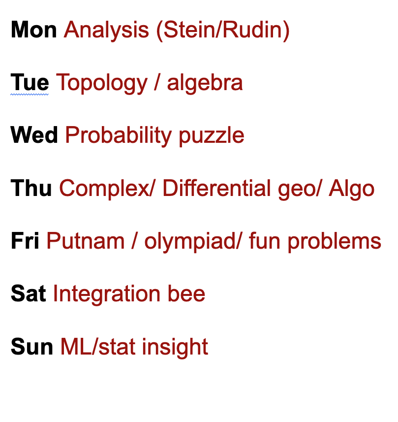

# Brain Teaser

> Last updated: 2026-08-14 21:17 UTC

## Problem Schedule

## Welcome

This is a personal collection of small but beautiful mathematical problems — one a day, organized by topic.
Problems come from Putnam, olympiads, probability puzzles, integration bees, complex analysis, differential geometry, ML/stats, and more.

**Contributions and feedback are welcome!** Feel free to open an issue or PR if you have a problem to suggest, a cleaner solution, or a correction.

---

## Problem List

| # | Name | Type | Tags | Date | Solved | Redo | Comments | Related | Question | Answer |
|---|------|------|------|------|--------|------|----------|---------|----------|--------|
| 1 | Lp Norm → L∞ | analysis | `Lp norm`, `Limit`, `Squeeze Theorem` | 2026-03-09 |  |  |  |  | [view](questions/lp_norm_infinity/question.md) | [view](questions/lp_norm_infinity/answer.md) |
| 2 | Expected Number of Records | Probability | `Expectation`, `Linearity of expectation`, `Permutations`, `Harmonic numbers` | 2026-03-11 |  |  |  |  | [view](questions/expected_records/question.md) | [view](questions/expected_records/answer.md) |
| 3 | Bertrand's Ballot Problem | Probability | `Ballot problem`, `Reflection principle`, `Counting paths` | 2026-03-11 |  |  |  |  | [view](questions/bertrand_ballot/question.md) | [view](questions/bertrand_ballot/answer.md) |
| 4 | The Schwarz Lemma | Complex Analysis | `Maximum modulus principle`, `Holomorphic functions`, `Unit disk` | 2026-03-12 |  |  |  |  | [view](questions/schwarz_lemma/question.md) | [view](questions/schwarz_lemma/answer.md) |
| 5 | Parallel Transport on a Sphere | Differential Geometry | `Parallel transport`, `Holonomy`, `Gauss-Bonnet`, `Curvature` | 2026-03-12 |  |  |  |  | [view](questions/parallel_transport_sphere/question.md) | [view](questions/parallel_transport_sphere/answer.md) |
| 6 | Polynomial with No Integer Roots | Putnam | `Polynomials`, `Parity`, `Integer roots`, `Modular arithmetic` | 2026-03-13 |  |  |  |  | [view](questions/polynomial_no_integer_roots/question.md) | [view](questions/polynomial_no_integer_roots/answer.md) |
| 7 | Harmonic Series Is Never an Integer | Putnam | `Harmonic series`, `Primes`, `Bertrand's postulate`, `LCM`, `Divisibility` | 2026-03-13 |  |  |  |  | [view](questions/harmonic_not_integer/question.md) | [view](questions/harmonic_not_integer/answer.md) |
| 8 | Integral of a Geometric Series | Integration | `Geometric series`, `Interchange sum/integral`, `Logarithm` | 2026-03-14 |  |  |  |  | [view](questions/geometric_series_integral/question.md) | [view](questions/geometric_series_integral/answer.md) |
| 9 | Bertrand's Chord Paradox | Probability | `Geometric probability`, `Measure`, `Paradox`, `Sample space` | 2026-03-24 |  |  |  |  | [view](questions/bertrand_chord_paradox/question.md) | [view](questions/bertrand_chord_paradox/answer.md) |
| 10 | The Hat Check Problem | Probability | `Derangements`, `Inclusion-exclusion`, `Permutations` | 2026-03-25 |  |  |  |  | [view](questions/derangement_hat_check/question.md) | [view](questions/derangement_hat_check/answer.md) |
| 11 | FTA via Liouville's Theorem | Complex Analysis | `Liouville`, `Entire functions`, `Fundamental theorem of algebra` | 2026-03-26 |  |  |  |  | [view](questions/fta_liouville/question.md) | [view](questions/fta_liouville/answer.md) |
| 12 | Curvature of an Embedded Torus | Differential Geometry | `Gaussian curvature`, `Gauss-Bonnet`, `Euler characteristic`, `Torus` | 2026-03-26 |  |  |  |  | [view](questions/torus_curvature/question.md) | [view](questions/torus_curvature/answer.md) |
| 13 | No Function with f(f(n)) = n + 2025 | Putnam | `Functions`, `Involution`, `Modular arithmetic`, `Fixed points`, `Parity` | 2026-03-27 |  |  |  |  | [view](questions/involution_odd_shift/question.md) | [view](questions/involution_odd_shift/answer.md) |
| 14 | Truncated Exponential Has No Repeated Roots | Putnam | `Polynomials`, `Repeated roots`, `Derivatives`, `Truncated exponential` | 2026-03-27 |  |  |  |  | [view](questions/truncated_exp_no_repeated_roots/question.md) | [view](questions/truncated_exp_no_repeated_roots/answer.md) |
| 15 | Integral of x² sin(x) | Integration | `Integration by parts`, `Tabular method`, `Trigonometric integrals` | 2026-03-28 |  |  |  |  | [view](questions/integral_x2_sinx/question.md) | [view](questions/integral_x2_sinx/answer.md) |
| 16 | Stein's Paradox | ML/Stats | `Admissibility`, `James-Stein`, `Shrinkage`, `MSE`, `Regularization` | 2026-03-29 |  |  |  |  | [view](questions/steins_paradox/question.md) | [view](questions/steins_paradox/answer.md) |
| 17 | Orthogonality to All Monomials Forces Zero | analysis | `Weierstrass approximation`, `Orthogonality`, `Density argument`, `L2` | 2026-03-30 |  |  |  |  | [view](questions/orthogonal_to_polynomials/question.md) | [view](questions/orthogonal_to_polynomials/answer.md) |
| 18 | Consecutive Subsum Divisible by n | Putnam | `Pigeonhole`, `Partial sums`, `Divisibility`, `Modular arithmetic` | 2026-04-03 |  |  |  |  | [view](questions/consecutive_sum_divisible/question.md) | [view](questions/consecutive_sum_divisible/answer.md) |
| 19 | Integral of (x-1)²/(2eˣ+x²+1) | Integration | `Logarithmic derivative`, `Integration bee`, `Algebraic manipulation` | 2026-04-04 |  |  |  |  | [view](questions/integral_x_minus_1_sq/question.md) | [view](questions/integral_x_minus_1_sq/answer.md) |
| 20 | Continuous but Nowhere Differentiable | analysis | `Weierstrass function`, `Uniform convergence`, `Counterexample`, `Fractal` | 2026-04-06 |  |  |  |  | [view](questions/continuous_nowhere_differentiable/question.md) | [view](questions/continuous_nowhere_differentiable/answer.md) |
| 21 | Why LASSO Gives Sparsity but Ridge Does Not | ML/Stats | `LASSO`, `Ridge`, `Sparsity`, `Regularization`, `Convex geometry` | 2026-04-19 |  |  |  |  | [view](questions/lasso_vs_ridge_sparsity/question.md) | [view](questions/lasso_vs_ridge_sparsity/answer.md) |
| 22 | The Cantor Set: Measure Zero yet Uncountable | analysis | `Cantor set`, `Measure theory`, `Cardinality`, `Uncountability` | 2026-04-20 |  |  |  |  | [view](questions/cantor_set_measure_zero/question.md) | [view](questions/cantor_set_measure_zero/answer.md) |
| 23 | The Topologist's Sine Curve | topology | `Connectedness`, `Path-connectedness`, `Closure`, `Counterexample` | 2026-04-21 |  |  |  |  | [view](questions/topologist_sine_curve/question.md) | [view](questions/topologist_sine_curve/answer.md) |
| 24 | Entire Function with Non-Negative Real Part | Complex Analysis | `Entire functions`, `Liouville`, `Mobius transformation`, `Bounded functions` | 2026-04-23 |  |  |  |  | [view](questions/entire_positive_real_part/question.md) | [view](questions/entire_positive_real_part/answer.md) |
| 25 | An Impossible Integer Polynomial | Putnam | `Polynomials`, `Integer coefficients`, `Divisibility`, `Modular arithmetic` | 2026-04-24 |  |  |  |  | [view](questions/polynomial_integer_values/question.md) | [view](questions/polynomial_integer_values/answer.md) |
| 26 | Integral of a Max with a Circle | Integration | `Integration bee`, `Geometric interpretation`, `Circular segment`, `Area` | 2026-04-25 |  |  |  |  | [view](questions/integral_max_circle/question.md) | [view](questions/integral_max_circle/answer.md) |
| 27 | Dini's Theorem: When Pointwise Becomes Uniform | analysis | `Uniform convergence`, `Pointwise convergence`, `Compactness`, `Dini` | 2026-04-25 |  |  |  |  | [view](questions/dini_theorem/question.md) | [view](questions/dini_theorem/answer.md) |
| 28 | Fundamental Group of the Circle Is ℤ | topology | `fundamental group`, `covering spaces`, `winding number`, `homotopy`, `pi_1(S^1)` | 2026-05-05 |  |  |  |  | [view](questions/2026-05-05_am/question.md) | [view](questions/2026-05-05_am/answer.md) |
| 29 | The Comb Space Is Not Locally Connected | topology | `local connectedness`, `connectedness`, `counterexample`, `comb space`, `point-set topology` | 2026-05-05 |  |  |  |  | [view](questions/2026-05-05_pm/question.md) | [view](questions/2026-05-05_pm/answer.md) |
| 30 | Coupon Collector Problem | Probability | `geometric distribution`, `harmonic numbers`, `expectation`, `linearity of expectation`, `asymptotics` | 2026-05-06 |  |  |  |  | [view](questions/2026-05-06_am/question.md) | [view](questions/2026-05-06_am/answer.md) |
| 31 | Gambler's Ruin: Probability and Expected Duration | Probability | `martingale`, `optional stopping`, `random walk`, `gambler's ruin`, `expected hitting time` | 2026-05-06 |  |  |  |  | [view](questions/2026-05-06_pm/question.md) | [view](questions/2026-05-06_pm/answer.md) |
| 32 | Rouché's Theorem: Zeros of z⁵+3z+1 | Complex Analysis | `Rouché's theorem`, `argument principle`, `zeros of polynomials`, `unit disk` | 2026-05-07 |  |  |  |  | [view](questions/2026-05-07_am/question.md) | [view](questions/2026-05-07_am/answer.md) |
| 33 | Entire Function Avoiding a Disk Must Be Constant | Complex Analysis | `Liouville's theorem`, `entire functions`, `open mapping theorem`, `image of holomorphic maps` | 2026-05-07 |  |  |  |  | [view](questions/2026-05-07_pm/question.md) | [view](questions/2026-05-07_pm/answer.md) |
| 34 | Ordered Triples of Sets Covering {1,...,10} | Putnam | `combinatorics`, `set theory`, `counting`, `independence` | 2026-05-08 |  |  |  |  | [view](questions/2026-05-08_am/question.md) | [view](questions/2026-05-08_am/answer.md) |
| 35 | Pigeonhole on an Icosahedron | Putnam | `pigeonhole`, `double counting`, `combinatorics`, `graph theory`, `icosahedron` | 2026-05-08 |  |  |  |  | [view](questions/2026-05-08_pm/question.md) | [view](questions/2026-05-08_pm/answer.md) |
| 36 | The Gaussian Integral's Elegant Cousin | Integration | `Fresnel integral`, `Gaussian integral`, `Laplace transform`, `double integral`, `Fubini` | 2026-05-09 |  |  |  |  | [view](questions/2026-05-09_am/question.md) | [view](questions/2026-05-09_am/answer.md) |
| 37 | Integral of ln(sin x) | Integration | `definite integral`, `symmetry`, `duplication trick`, `logarithmic integral`, `classic` | 2026-05-09 |  |  |  |  | [view](questions/2026-05-09_pm/question.md) | [view](questions/2026-05-09_pm/answer.md) |
| 38 | Optimism of Training Error | ML/Stats | `bias`, `overfitting`, `model selection`, `degrees of freedom`, `covariance` | 2026-05-10 |  |  |  |  | [view](questions/2026-05-10_am/question.md) | [view](questions/2026-05-10_am/answer.md) |
| 39 | Bias-Variance Decomposition | ML/Stats | `bias-variance tradeoff`, `expected prediction error`, `model complexity`, `squared loss` | 2026-05-10 |  |  |  |  | [view](questions/2026-05-10_pm/question.md) | [view](questions/2026-05-10_pm/answer.md) |
| 40 | Dirichlet Function and Lebesgue Measure Zero | analysis | `Lebesgue integration`, `measure zero`, `Riemann vs Lebesgue`, `Monotone Convergence Theorem`, `Dirichlet function` | 2026-05-11 |  |  |  |  | [view](questions/2026-05-11_am/question.md) | [view](questions/2026-05-11_am/answer.md) |
| 41 | Nowhere-Zero Derivative Paradox | analysis | `Darboux's theorem`, `intermediate value property`, `derivatives`, `real analysis` | 2026-05-11 |  |  |  |  | [view](questions/2026-05-11_pm/question.md) | [view](questions/2026-05-11_pm/answer.md) |
| 42 | Fundamental Group of the Torus via Van Kampen | topology | `fundamental group`, `van Kampen`, `torus`, `CW complex`, `algebraic topology` | 2026-05-12 |  |  |  |  | [view](questions/2026-05-12_am/question.md) | [view](questions/2026-05-12_am/answer.md) |
| 43 | Klein Bottle Is Non-Orientable and Doesn't Embed in R³ | topology | `Klein bottle`, `orientability`, `Möbius band`, `surfaces`, `embedding`, `fundamental polygon` | 2026-05-12 |  |  |  |  | [view](questions/2026-05-12_pm/question.md) | [view](questions/2026-05-12_pm/answer.md) |
| 44 | The Prisoner's Dilemma | Probability | `Bayesian reasoning`, `conditional probability`, `Monty Hall`, `sample space` | 2026-05-13 |  |  |  |  | [view](questions/2026-05-13_am/question.md) | [view](questions/2026-05-13_am/answer.md) |
| 45 | The Unfair Coin That Becomes Fair | Probability | `coin flip`, `symmetry`, `von Neumann`, `simulation`, `geometric distribution` | 2026-05-13 |  |  |  |  | [view](questions/2026-05-13_pm/question.md) | [view](questions/2026-05-13_pm/answer.md) |
| 46 | Argument Principle: Zeros in an Annulus | Complex Analysis | `argument principle`, `Rouché's theorem`, `winding number`, `zeros of polynomials`, `logarithmic derivative` | 2026-05-14 |  |  |  |  | [view](questions/2026-05-14_am/question.md) | [view](questions/2026-05-14_am/answer.md) |
| 47 | Residue at Infinity and the Sum Rule | Complex Analysis | `residues`, `Riemann sphere`, `rational functions`, `residue at infinity`, `compactness` | 2026-05-14 |  |  |  |  | [view](questions/2026-05-14_pm/question.md) | [view](questions/2026-05-14_pm/answer.md) |
| 48 | A Polynomial That Takes the Value 1 Too Often | Putnam | `polynomials`, `integer coefficients`, `divisibility`, `pigeonhole`, `factoring` | 2026-05-15 |  |  |  |  | [view](questions/2026-05-15_am/question.md) | [view](questions/2026-05-15_am/answer.md) |
| 49 | The Basel-Flavored Integral | Integration | `power series`, `term-by-term integration`, `Basel series`, `pi squared` | 2026-05-16 |  |  |  |  | [view](questions/2026-05-16_am/question.md) | [view](questions/2026-05-16_am/answer.md) |
| 50 | Sophomore's Dream Integral | Integration | `series`, `power series`, `gamma function`, `substitution`, `x^x` | 2026-05-16 |  |  |  |  | [view](questions/2026-05-16_pm/question.md) | [view](questions/2026-05-16_pm/answer.md) |
| 51 | Variance of OLS Along Singular Directions and Ridge Shrinkage | ML/Stats | `ridge regression`, `SVD`, `bias-variance tradeoff`, `linear regression`, `spectral geometry` | 2026-05-17 |  |  |  |  | [view](questions/2026-05-17_pm/question.md) | [view](questions/2026-05-17_pm/answer.md) |
| 52 | Weierstrass Series: Continuity via Abel Summation | analysis | `uniform convergence`, `Dirichlet test`, `Abel summation`, `Weierstrass function`, `continuity` | 2026-05-18 |  |  |  |  | [view](questions/2026-05-18_am/question.md) | [view](questions/2026-05-18_am/answer.md) |
| 53 | Vanishing Integral on All Measurable Sets | analysis | `Lebesgue integration`, `measure theory`, `differentiation theorem`, `null sets` | 2026-05-18 |  |  |  |  | [view](questions/2026-05-18_pm/question.md) | [view](questions/2026-05-18_pm/answer.md) |
| 54 | Baire Category: Q Is Not a G-delta | topology | `Baire category theorem`, `complete metric space`, `G-delta sets`, `meager sets`, `rationals` | 2026-05-19 |  |  |  |  | [view](questions/2026-05-19_am/question.md) | [view](questions/2026-05-19_am/answer.md) |
| 55 | Hairy Ball Theorem via Degree Theory | topology | `degree of a map`, `homotopy`, `vector fields`, `S^2`, `hairy ball theorem`, `Poincaré-Hopf` | 2026-05-19 |  |  |  |  | [view](questions/2026-05-19_pm/question.md) | [view](questions/2026-05-19_pm/answer.md) |
| 56 | The First Ace | Probability | `symmetry`, `expected value`, `combinatorics`, `deck of cards` | 2026-05-20 |  |  |  |  | [view](questions/2026-05-20_am/question.md) | [view](questions/2026-05-20_am/answer.md) |
| 57 | Broken Bar Triangle Probability | Probability | `geometric probability`, `triangle inequality`, `uniform distribution`, `classic puzzle` | 2026-05-20 |  |  |  |  | [view](questions/2026-05-20_pm/question.md) | [view](questions/2026-05-20_pm/answer.md) |
| 58 | Logarithmic Derivative and Integrality of Winding | Complex Analysis | `winding number`, `logarithmic derivative`, `argument principle`, `contour integral`, `complex logarithm` | 2026-05-21 |  |  |  |  | [view](questions/2026-05-21_am/question.md) | [view](questions/2026-05-21_am/answer.md) |
| 59 | Open Mapping + Liouville: Dense Image of Entire Functions | Complex Analysis | `Open Mapping Theorem`, `Liouville's Theorem`, `entire functions`, `dense image`, `Picard` | 2026-05-21 |  |  |  |  | [view](questions/2026-05-21_pm/question.md) | [view](questions/2026-05-21_pm/answer.md) |
| 60 | Sum of Squares Under a Linear Constraint | Putnam | `infinite series`, `optimization`, `inequalities`, `Putnam 2000` | 2026-05-22 |  |  |  |  | [view](questions/2026-05-22_pm/question.md) | [view](questions/2026-05-22_pm/answer.md) |
| 61 | Integral of ln(1+x²)/(1+x²) | Integration | `substitution`, `Catalan constant`, `logarithmic integral`, `Clausen integral` | 2026-05-23 |  |  |  |  | [view](questions/2026-05-23_pm/question.md) | [view](questions/2026-05-23_pm/answer.md) |
| 62 | The Double Descent Puzzle | ML/Stats | `double descent`, `overparameterization`, `minimum norm`, `implicit regularization`, `bias-variance`, `pseudoinverse` | 2026-05-24 |  |  |  |  | [view](questions/2026-05-24_am/question.md) | [view](questions/2026-05-24_am/answer.md) |
| 63 | The Variance of Bagging | ML/Stats | `bagging`, `bias-variance`, `bootstrap`, `correlation`, `ensemble methods` | 2026-05-24 |  |  |  |  | [view](questions/2026-05-24_pm/question.md) | [view](questions/2026-05-24_pm/answer.md) |
| 64 | Lebesgue Differentiation: Failure Everywhere? | analysis | `Lebesgue differentiation theorem`, `measure theory`, `averaging`, `null sets`, `Lebesgue points` | 2026-05-25 |  |  |  |  | [view](questions/2026-05-25_am/question.md) | [view](questions/2026-05-25_am/answer.md) |
| 65 | Zero-Mean Functions: A Closed Hyperplane in C([0,1]) | analysis | `functional analysis`, `Banach spaces`, `uniform approximation`, `hyperplane`, `integration` | 2026-05-25 |  |  |  |  | [view](questions/2026-05-25_pm/question.md) | [view](questions/2026-05-25_pm/answer.md) |
| 66 | Möbius Band Has Fundamental Group ℤ | topology | `fundamental group`, `deformation retract`, `Möbius band`, `homotopy`, `topology` | 2026-05-26 |  |  |  |  | [view](questions/2026-05-26_pm/question.md) | [view](questions/2026-05-26_pm/answer.md) |
| 67 | Ballot Problem: Strictly Leading Throughout | Probability | `ballot problem`, `reflection principle`, `lattice paths`, `combinatorics`, `random walks` | 2026-05-27 |  |  |  |  | [view](questions/2026-05-27_am/question.md) | [view](questions/2026-05-27_am/answer.md) |
| 68 | The Collector's Last Coupon | Probability | `order statistics`, `waiting time`, `symmetry`, `combinatorics`, `without replacement` | 2026-05-27 |  |  |  |  | [view](questions/2026-05-27_pm/question.md) | [view](questions/2026-05-27_pm/answer.md) |
| 69 | Winding Number Is Always an Integer | Complex Analysis | `winding number`, `closed curve`, `exponential`, `log-derivative`, `integrating factor` | 2026-05-28 |  |  |  |  | [view](questions/2026-05-28_pm/question.md) | [view](questions/2026-05-28_pm/answer.md) |
| 70 | Can A² + B² Be Invertible? | Putnam | `linear algebra`, `matrix factorization`, `invertibility`, `Putnam 1991` | 2026-05-29 |  |  |  |  | [view](questions/2026-05-29_am/question.md) | [view](questions/2026-05-29_am/answer.md) |
| 71 | A Determinant of Sums | Putnam | `linear algebra`, `determinant`, `row operations`, `telescoping`, `Brownian motion` | 2026-05-29 |  |  |  |  | [view](questions/2026-05-29_pm/question.md) | [view](questions/2026-05-29_pm/answer.md) |
| 72 | Integral of x^n ln x and Basel | Integration | `Feynman differentiation under integral sign`, `Basel problem`, `zeta function`, `geometric series` | 2026-05-30 |  |  |  |  | [view](questions/2026-05-30_am/question.md) | [view](questions/2026-05-30_am/answer.md) |
| 73 | Fresnel-Flavored Integral | Integration | `Gaussian integral`, `Laplace transform`, `double integral`, `Fubini`, `Fresnel` | 2026-05-30 |  |  |  |  | [view](questions/2026-05-30_pm/question.md) | [view](questions/2026-05-30_pm/answer.md) |
| 74 | Curse of Dimensionality: Shell Concentration | ML/Stats | `curse of dimensionality`, `high dimensions`, `k-NN`, `volume concentration`, `statistical learning` | 2026-05-31 |  |  |  |  | [view](questions/2026-05-31_am/question.md) | [view](questions/2026-05-31_am/answer.md) |
| 75 | The Blessing of Averaging: Boosting Margins | ML/Stats | `boosting`, `AdaBoost`, `margins`, `generalization`, `overfitting`, `ensemble methods` | 2026-05-31 |  |  |  |  | [view](questions/2026-05-31_pm/question.md) | [view](questions/2026-05-31_pm/answer.md) |
| 76 | Two Integral Conditions Force Two Zeros | analysis | `orthogonality`, `sign-change argument`, `continuous functions`, `mean value`, `Rudin-style` | 2026-06-01 |  |  |  |  | [view](questions/2026-06-01_pm/question.md) | [view](questions/2026-06-01_pm/answer.md) |
| 77 | Fundamental Group of S¹ ∨ S¹ Is Non-Abelian | topology | `fundamental group`, `van Kampen`, `free product`, `wedge sum`, `non-abelian` | 2026-06-02 |  |  |  |  | [view](questions/2026-06-02_am/question.md) | [view](questions/2026-06-02_am/answer.md) |
| 78 | Fundamental Group of RP² | topology | `fundamental group`, `van Kampen`, `projective plane`, `CW complex`, `covering spaces` | 2026-06-02 |  |  |  |  | [view](questions/2026-06-02_pm/question.md) | [view](questions/2026-06-02_pm/answer.md) |
| 79 | The Thick Coin | Probability | `geometric probability`, `sphere`, `zone area`, `Archimedes`, `3D geometry` | 2026-06-03 |  |  |  |  | [view](questions/2026-06-03_am/question.md) | [view](questions/2026-06-03_am/answer.md) |
| 80 | Cycle Lemma: Staying Strictly Ahead | Probability | `ballot problem`, `cycle lemma`, `combinatorics`, `random walks`, `elegant formula` | 2026-06-03 |  |  |  |  | [view](questions/2026-06-03_pm/question.md) | [view](questions/2026-06-03_pm/answer.md) |
| 81 | Maximum Modulus & Schwarz Equality Case | Complex Analysis | `maximum modulus principle`, `Schwarz lemma`, `holomorphic maps`, `mean value property`, `open mapping theorem` | 2026-06-04 |  |  |  |  | [view](questions/2026-06-04_am/question.md) | [view](questions/2026-06-04_am/answer.md) |
| 82 | A Holomorphic Function That Is Its Own Derivative | Complex Analysis | `entire functions`, `power series`, `functional equation`, `exponential function`, `uniqueness` | 2026-06-04 |  |  |  |  | [view](questions/2026-06-04_pm/question.md) | [view](questions/2026-06-04_pm/answer.md) |
| 83 | Functional Equation: From Symmetry to a Difference | Putnam | `functional equation`, `cocycle`, `coboundary`, `elegant construction` | 2026-06-05 |  |  |  |  | [view](questions/2026-06-05_am/question.md) | [view](questions/2026-06-05_am/answer.md) |
| 84 | Feynman's Trick: arctan(x)/x and Catalan's Constant | Integration | `Feynman differentiation under the integral`, `Catalan's constant`, `double integral`, `series expansion`, `integration bee` | 2026-06-06 |  |  |  |  | [view](questions/2026-06-06_am/question.md) | [view](questions/2026-06-06_am/answer.md) |
| 85 | The Kernel Trick: Why Inner Products Are All You Need | ML/Stats | `kernel trick`, `feature maps`, `SVM`, `polynomial kernel`, `dimensionality`, `inner product` | 2026-06-07 |  |  |  |  | [view](questions/2026-06-07_am/question.md) | [view](questions/2026-06-07_am/answer.md) |
| 86 | Optimism of Training Error and the LOO Shortcut | ML/Stats | `optimism`, `cross-validation`, `hat matrix`, `leverage`, `bias`, `generalization`, `OLS` | 2026-06-07 |  |  |  |  | [view](questions/2026-06-07_pm/question.md) | [view](questions/2026-06-07_pm/answer.md) |
| 87 | Riemann–Lebesgue Lemma | analysis | `Fourier analysis`, `approximation argument`, `Riemann integral`, `oscillatory integrals` | 2026-06-08 |  |  |  |  | [view](questions/2026-06-08_am/question.md) | [view](questions/2026-06-08_am/answer.md) |
| 88 | Monotone Convergence Fails for Decreasing Sequences Without Integrability | analysis | `measure theory`, `MCT`, `Fatou's lemma`, `dominated convergence`, `counterexample` | 2026-06-08 |  |  |  |  | [view](questions/2026-06-08_pm/question.md) | [view](questions/2026-06-08_pm/answer.md) |
| 89 | Fundamental Group of S¹ ∨ S² | topology | `fundamental group`, `van Kampen`, `wedge sum`, `higher homotopy`, `simply connected` | 2026-06-09 |  |  |  |  | [view](questions/2026-06-09_am/question.md) | [view](questions/2026-06-09_am/answer.md) |
| 90 | Hawaiian Earring Is Not Semi-Locally Simply Connected | topology | `fundamental group`, `covering spaces`, `semi-local simple connectivity`, `Hawaiian earring`, `counterexample` | 2026-06-09 |  |  |  |  | [view](questions/2026-06-09_pm/question.md) | [view](questions/2026-06-09_pm/answer.md) |
| 91 | HH vs HT: Waiting Times for Coin Patterns | Probability | `Markov chains`, `expected value`, `coin flipping`, `pattern waiting time`, `state equations` | 2026-06-10 |  |  |  |  | [view](questions/2026-06-10_am/question.md) | [view](questions/2026-06-10_am/answer.md) |
| 92 | Second-Best Runner-Up | Probability | `tournament`, `combinatorics`, `indicator trick`, `bracket` | 2026-06-10 |  |  |  |  | [view](questions/2026-06-10_pm/question.md) | [view](questions/2026-06-10_pm/answer.md) |
| 93 | Gauss–Lucas Theorem | Complex Analysis | `logarithmic derivative`, `convex hull`, `roots of derivatives`, `separation theorem` | 2026-06-11 |  |  |  |  | [view](questions/2026-06-11_am/question.md) | [view](questions/2026-06-11_am/answer.md) |
| 94 | Möbius Transformation Fixed by Three Points | Complex Analysis | `Möbius transformation`, `fixed points`, `rigidity`, `cross-ratio`, `complex analysis` | 2026-06-11 |  |  |  |  | [view](questions/2026-06-11_pm/question.md) | [view](questions/2026-06-11_pm/answer.md) |
| 95 | A Sequence That Always Hits a Perfect Square | Putnam | `sequences`, `perfect squares`, `number theory`, `fixed points`, `parity argument` | 2026-06-12 |  |  |  |  | [view](questions/2026-06-12_am/question.md) | [view](questions/2026-06-12_am/answer.md) |
| 96 | Integral of sqrt(tan x) | Integration | `substitution`, `symmetry`, `rational integral`, `Feynman-style`, `integration bee` | 2026-06-13 |  |  |  |  | [view](questions/2026-06-13_am/question.md) | [view](questions/2026-06-13_am/answer.md) |
| 97 | The King's Integral | Integration | `symmetry`, `substitution`, `trigonometric integral`, `King's rule` | 2026-06-13 |  |  |  |  | [view](questions/2026-06-13_pm/question.md) | [view](questions/2026-06-13_pm/answer.md) |
| 98 | The Infinite Ensemble That Doesn't Help | ML/Stats | `ensemble methods`, `bias-variance tradeoff`, `bagging`, `correlation`, `variance reduction` | 2026-06-14 |  |  |  |  | [view](questions/2026-06-14_am/question.md) | [view](questions/2026-06-14_am/answer.md) |
| 99 | Curse of Dimensionality: Volume Collapse | ML/Stats | `curse of dimensionality`, `k-NN`, `local methods`, `high dimensions`, `nonparametric` | 2026-06-14 |  |  |  |  | [view](questions/2026-06-14_pm/question.md) | [view](questions/2026-06-14_pm/answer.md) |
| 100 | Alternating Series Beyond the M-Test | analysis | `uniform convergence`, `alternating series`, `Weierstrass M-test`, `real analysis`, `continuity` | 2026-06-15 |  |  |  |  | [view](questions/2026-06-15_pm/question.md) | [view](questions/2026-06-15_pm/answer.md) |
| 101 | The Dunce Hat Is Contractible | topology | `CW-complexes`, `fundamental group`, `van Kampen`, `contractibility`, `cellular homology`, `Whitehead theorem` | 2026-06-16 |  |  |  |  | [view](questions/2026-06-16_am/question.md) | [view](questions/2026-06-16_am/answer.md) |
| 102 |  |  |  | 2026-06-16 |  |  |  |  | [view](questions/2026-06-16_pm/question.md) | [view](questions/2026-06-16_pm/answer.md) |
| 103 | The Collector's Rival: Who Finishes First? | Probability | `coupon collector`, `inclusion-exclusion`, `geometric distribution`, `racing processes` | 2026-06-17 |  |  |  |  | [view](questions/2026-06-17_am/question.md) | [view](questions/2026-06-17_am/answer.md) |
| 104 | The Absent-Minded Secretary | Probability | `derangements`, `inclusion-exclusion`, `combinatorics`, `e`, `permutations` | 2026-06-17 |  |  |  |  | [view](questions/2026-06-17_pm/question.md) | [view](questions/2026-06-17_pm/answer.md) |
| 105 | Argument of a Product Along a Circle | Complex Analysis | `logarithmic derivative`, `argument principle`, `residue theorem`, `winding number`, `polynomials` | 2026-06-18 |  |  |  |  | [view](questions/2026-06-18_am/question.md) | [view](questions/2026-06-18_am/answer.md) |
| 106 | Schwarz–Pick Lemma: Holomorphic Maps Contract the Disk | Complex Analysis | `Schwarz Lemma`, `Möbius transformations`, `hyperbolic geometry`, `holomorphic maps`, `unit disk` | 2026-06-18 |  |  |  |  | [view](questions/2026-06-18_pm/question.md) | [view](questions/2026-06-18_pm/answer.md) |
| 107 | Shanille's Free Throws: Pólya Urn Surprise | Putnam | `Pólya urn`, `probability`, `symmetry`, `combinatorics`, `Putnam 2002` | 2026-06-19 |  |  |  |  | [view](questions/2026-06-19_am/question.md) | [view](questions/2026-06-19_am/answer.md) |
| 108 | The Beta-Flavored Integral | Integration | `Beta function`, `Feynman decomposition`, `combinatorial identity`, `definite integral` | 2026-06-20 |  |  |  |  | [view](questions/2026-06-20_am/question.md) | [view](questions/2026-06-20_am/answer.md) |
| 109 | The Sinc Integral | Integration | `Feynman trick`, `Laplace transform`, `differentiation under the integral sign`, `sinc function` | 2026-06-20 |  |  |  |  | [view](questions/2026-06-20_pm/question.md) | [view](questions/2026-06-20_pm/answer.md) |
| 110 | KDE Bandwidth Bias-Variance Tradeoff | ML/Stats | `kernel density estimation`, `bias-variance tradeoff`, `nonparametric statistics`, `bandwidth selection`, `MSE` | 2026-06-21 |  |  |  |  | [view](questions/2026-06-21_am/question.md) | [view](questions/2026-06-21_am/answer.md) |
| 111 | SVM Margin Width: Why 2/‖β‖? | ML/Stats | `SVM`, `margin`, `convex optimization`, `geometric intuition`, `normalization` | 2026-06-21 |  |  |  |  | [view](questions/2026-06-21_pm/question.md) | [view](questions/2026-06-21_pm/answer.md) |
| 112 | Devil's Staircase: FTC Fails Without Absolute Continuity | analysis | `Cantor function`, `absolute continuity`, `FTC`, `Lebesgue integration`, `measure zero` | 2026-06-22 |  |  |  |  | [view](questions/2026-06-22_pm/question.md) | [view](questions/2026-06-22_pm/answer.md) |
| 113 | Hawaiian Earring vs Infinite Wedge: Compact vs Not | topology | `compactness`, `Hawaiian earring`, `wedge sum`, `CW topology`, `homeomorphism invariants` | 2026-06-23 |  |  |  |  | [view](questions/2026-06-23_am/question.md) | [view](questions/2026-06-23_am/answer.md) |
| 114 | Suspension Kills Fundamental Group | topology | `fundamental group`, `Van Kampen`, `suspension`, `simply connected`, `algebraic topology` | 2026-06-23 |  |  |  |  | [view](questions/2026-06-23_pm/question.md) | [view](questions/2026-06-23_pm/answer.md) |
| 115 | Expected Runs of Heads | Probability | `indicator variables`, `linearity of expectation`, `coin flips`, `runs` | 2026-06-24 |  |  |  |  | [view](questions/2026-06-24_am/question.md) | [view](questions/2026-06-24_am/answer.md) |
| 116 | The Matching Birthdays: Expected Collisions | Probability | `linearity of expectation`, `birthday problem`, `Poisson approximation`, `indicator variables` | 2026-06-24 |  |  |  |  | [view](questions/2026-06-24_pm/question.md) | [view](questions/2026-06-24_pm/answer.md) |
| 117 | Riemann's Removable Singularity via zf(z)→0 | Complex Analysis | `removable singularity`, `holomorphic extension`, `Taylor series`, `Riemann's theorem` | 2026-06-25 |  |  |  |  | [view](questions/2026-06-25_pm/question.md) | [view](questions/2026-06-25_pm/answer.md) |
| 118 | A Square Vanishing Function Must Be Identically Zero | Putnam | `functional equation`, `combinatorial identity`, `additive functions`, `elegant algebra` | 2026-06-26 |  |  |  |  | [view](questions/2026-06-26_pm/question.md) | [view](questions/2026-06-26_pm/answer.md) |
| 119 | Integral of ln(sin x) via Symmetry | Integration | `definite integral`, `symmetry`, `double-angle identity`, `logarithm`, `Wallis` | 2026-06-27 |  |  |  |  | [view](questions/2026-06-27_am/question.md) | [view](questions/2026-06-27_am/answer.md) |
| 120 | Wallis-Type Product Integral | Integration | `logarithmic integral`, `Catalan's constant`, `symmetry`, `amplitude-phase form`, `ln(sin)` | 2026-06-27 |  |  |  |  | [view](questions/2026-06-27_pm/question.md) | [view](questions/2026-06-27_pm/answer.md) |
| 121 | The Wisdom of Crowds: When Does Averaging Hurt? | ML/Stats | `ensemble methods`, `majority vote`, `correlation`, `law of large numbers`, `bias-variance` | 2026-06-28 |  |  |  |  | [view](questions/2026-06-28_am/question.md) | [view](questions/2026-06-28_am/answer.md) |
| 122 | The Irrelevant Feature Paradox: When Adding Noise Helps OLS | ML/Stats | `overfitting`, `bias-variance`, `OLS`, `degrees of freedom`, `optimism` | 2026-06-28 |  |  |  |  | [view](questions/2026-06-28_pm/question.md) | [view](questions/2026-06-28_pm/answer.md) |
| 123 | Conditionally Convergent Series of Functions: Pointwise but Not Uniform | analysis | `uniform convergence`, `Fourier series`, `Dirichlet test`, `pointwise convergence`, `sawtooth function` | 2026-06-29 |  |  |  |  | [view](questions/2026-06-29_am/question.md) | [view](questions/2026-06-29_am/answer.md) |
| 124 | The Integral That Knows Its Own Interval | Integration | `geometric series`, `Basel problem`, `improper integral`, `monotone convergence`, `series and integrals` | 2026-06-29 |  |  |  |  | [view](questions/2026-06-29_pm/question.md) | [view](questions/2026-06-29_pm/answer.md) |
| 125 | Quotient of Interval Gives Circle | topology | `quotient topology`, `compact-to-Hausdorff`, `homeomorphism`, `circle`, `identification space` | 2026-06-30 |  |  |  |  | [view](questions/2026-06-30_am/question.md) | [view](questions/2026-06-30_am/answer.md) |
| 126 | Fundamental Group of Doubly Punctured Plane | topology | `fundamental group`, `Van Kampen`, `free group`, `wedge sum`, `homotopy equivalence` | 2026-06-30 |  |  |  |  | [view](questions/2026-06-30_pm/question.md) | [view](questions/2026-06-30_pm/answer.md) |
| 127 | The Secretary Who Knows the Distribution | Probability | `optimal stopping`, `secretary problem`, `threshold strategy`, `uniform distribution`, `1/e` | 2026-07-01 |  |  |  |  | [view](questions/2026-07-01_am/question.md) | [view](questions/2026-07-01_am/answer.md) |
| 128 | The Gambler Who Can't Lose... Until He Does | Probability | `random walk`, `gambler's ruin`, `recurrence`, `martingale`, `quadratic trick` | 2026-07-01 |  |  |  |  | [view](questions/2026-07-01_pm/question.md) | [view](questions/2026-07-01_pm/answer.md) |
| 129 | Casorati–Weierstrass: Dense Image Near Essential Singularity | Complex Analysis | `essential singularity`, `Casorati-Weierstrass`, `Riemann removable singularity`, `proof by contradiction`, `dense image` | 2026-07-02 |  |  |  |  | [view](questions/2026-07-02_pm/question.md) | [view](questions/2026-07-02_pm/answer.md) |
| 130 | The Polynomial That Is Always Divisible by n! | Putnam | `divisibility`, `Vandermonde`, `binomial coefficients`, `determinant`, `combinatorics` | 2026-07-03 |  |  |  |  | [view](questions/2026-07-03_am/question.md) | [view](questions/2026-07-03_am/answer.md) |
| 131 | The Penny-Passing Game: Who Wins? | Putnam | `combinatorics`, `simulation`, `invariant`, `game theory`, `arithmetic progression` | 2026-07-03 |  |  |  |  | [view](questions/2026-07-03_pm/question.md) | [view](questions/2026-07-03_pm/answer.md) |
| 132 | The Gaussian-Polynomial Integral | Integration | `Feynman differentiation under integral`, `Gaussian integral`, `Gamma function`, `parametric differentiation` | 2026-07-04 |  |  |  |  | [view](questions/2026-07-04_am/question.md) | [view](questions/2026-07-04_am/answer.md) |
| 133 | Integral of 1/(1+tan^n x) | Integration | `King's substitution`, `symmetry`, `definite integral`, `integration bee` | 2026-07-04 |  |  |  |  | [view](questions/2026-07-04_pm/question.md) | [view](questions/2026-07-04_pm/answer.md) |
| 134 | Curse of Dimensionality: Nearest Neighbor Bias | ML/Stats | `curse of dimensionality`, `nearest neighbor`, `bias`, `high dimensions`, `local methods` | 2026-07-05 |  |  |  |  | [view](questions/2026-07-05_am/question.md) | [view](questions/2026-07-05_am/answer.md) |
| 135 | Ridge Regression as Augmented OLS | ML/Stats | `ridge regression`, `data augmentation`, `shrinkage`, `normal equations`, `regularization` | 2026-07-05 |  |  |  |  | [view](questions/2026-07-05_pm/question.md) | [view](questions/2026-07-05_pm/answer.md) |
| 136 | Generic Continuous Function Is Nowhere Differentiable | analysis | `Baire category`, `nowhere differentiable`, `C([0,1])`, `residual set`, `meager sets` | 2026-07-06 |  |  |  |  | [view](questions/2026-07-06_am/question.md) | [view](questions/2026-07-06_am/answer.md) |
| 137 | Pointwise Limits and Meagre Discontinuity Sets | analysis | `Baire category`, `pointwise convergence`, `oscillation`, `Baire-1 functions`, `meagre sets` | 2026-07-06 |  |  |  |  | [view](questions/2026-07-06_pm/question.md) | [view](questions/2026-07-06_pm/answer.md) |
| 138 | Collapsing Disk Boundary Gives Sphere | topology | `quotient space`, `compactness`, `homeomorphism`, `sphere`, `stereographic projection` | 2026-07-07 |  |  |  |  | [view](questions/2026-07-07_am/question.md) | [view](questions/2026-07-07_am/answer.md) |
| 139 | The Closed Subgroup of ℝ | topology | `topological groups`, `subgroups`, `closed sets`, `discrete subgroups`, `classification` | 2026-07-07 |  |  |  |  | [view](questions/2026-07-07_pm/question.md) | [view](questions/2026-07-07_pm/answer.md) |
| 140 | The Lazy Prisoner: A Probability Paradox | Probability | `Bayes theorem`, `conditional probability`, `Monty Hall`, `paradox`, `prisoner` | 2026-07-08 |  |  |  |  | [view](questions/2026-07-08_am/question.md) | [view](questions/2026-07-08_am/answer.md) |
| 141 | The Ballot Box Surprise: Two Candidates, One Mystery | Probability | `ballot problem`, `reflection principle`, `cycle lemma`, `combinatorics`, `lattice paths`, `sampling without replacement` | 2026-07-08 |  |  |  |  | [view](questions/2026-07-08_pm/question.md) | [view](questions/2026-07-08_pm/answer.md) |
| 142 | The Zeros That Refuse to Accumulate | Complex Analysis | `Identity Theorem`, `Blaschke product`, `zeros of analytic functions`, `boundary behavior` | 2026-07-09 |  |  |  |  | [view](questions/2026-07-09_am/question.md) | [view](questions/2026-07-09_am/answer.md) |
| 143 | The Harmonic Function That Knows Its Boundary | Complex Analysis | `mean value property`, `harmonic functions`, `boundary values`, `Poisson integral` | 2026-07-09 |  |  |  |  | [view](questions/2026-07-09_pm/question.md) | [view](questions/2026-07-09_pm/answer.md) |
| 144 | A Polynomial Evaluated at Consecutive Integers | Putnam | `polynomials`, `parity`, `integer roots`, `divisibility`, `number theory` | 2026-07-10 |  |  |  |  | [view](questions/2026-07-10_am/question.md) | [view](questions/2026-07-10_am/answer.md) |
| 145 | The Tournament Bracket Paradox | Putnam | `probabilistic method`, `combinatorics`, `tournaments`, `quadratic residues`, `existence proof` | 2026-07-10 |  |  |  |  | [view](questions/2026-07-10_pm/question.md) | [view](questions/2026-07-10_pm/answer.md) |
| 146 | Integral of 1/(1+sin²x) | Integration | `tan substitution`, `trigonometric integral`, `arctangent`, `integration bee` | 2026-07-11 |  |  |  |  | [view](questions/2026-07-11_am/question.md) | [view](questions/2026-07-11_am/answer.md) |
| 147 | The Dirichlet Beta Integral | Integration | `geometric series`, `differentiation under integral sign`, `Basel problem`, `series summation`, `pi squared` | 2026-07-11 |  |  |  |  | [view](questions/2026-07-11_pm/question.md) | [view](questions/2026-07-11_pm/answer.md) |
| 148 | AdaBoost Exponential Training Error Bound | ML/Stats | `AdaBoost`, `boosting`, `exponential loss`, `training error`, `weak learners` | 2026-07-12 |  |  |  |  | [view](questions/2026-07-12_am/question.md) | [view](questions/2026-07-12_am/answer.md) |
| 149 | Precision Matrix and Partial Correlations | ML/Stats | `Gaussian graphical models`, `conditional independence`, `precision matrix`, `partial correlation`, `Schur complement` | 2026-07-12 |  |  |  |  | [view](questions/2026-07-12_pm/question.md) | [view](questions/2026-07-12_pm/answer.md) |
| 150 | Frullani Integral: (e^{-x}-e^{-2x})/x | analysis | `Frullani integral`, `differentiation under the integral sign`, `improper integral`, `Feynman trick` | 2026-07-13 |  |  |  |  | [view](questions/2026-07-13_am/question.md) | [view](questions/2026-07-13_am/answer.md) |
| 151 | Monotone Function with Countably Many Discontinuities | analysis | `monotone functions`, `jump discontinuities`, `countability`, `real analysis`, `Rudin` | 2026-07-13 |  |  |  |  | [view](questions/2026-07-13_pm/question.md) | [view](questions/2026-07-13_pm/answer.md) |
| 152 | Fundamental Group of the Klein Bottle | topology | `fundamental group`, `van Kampen`, `Klein bottle`, `surface topology`, `non-abelian groups` | 2026-07-14 |  |  |  |  | [view](questions/2026-07-14_am/question.md) | [view](questions/2026-07-14_am/answer.md) |
| 153 | Open Subgroups of Topological Groups Are Closed | topology | `topological groups`, `subgroups`, `cosets`, `closure`, `open implies closed` | 2026-07-14 |  |  |  |  | [view](questions/2026-07-14_pm/question.md) | [view](questions/2026-07-14_pm/answer.md) |
| 154 | The Pepys–Newton Problem | Probability | `binomial distribution`, `expectation vs probability`, `CLT intuition`, `classic puzzle` | 2026-07-15 |  |  |  |  | [view](questions/2026-07-15_am/question.md) | [view](questions/2026-07-15_am/answer.md) |
| 155 | The Shared Birthday Secretary | Probability | `birthday paradox`, `expected value`, `tail sum`, `coupon collector`, `collision` | 2026-07-15 |  |  |  |  | [view](questions/2026-07-15_pm/question.md) | [view](questions/2026-07-15_pm/answer.md) |
| 156 | The Holomorphic Function Determined by Its Real Part | Complex Analysis | `Cauchy-Riemann equations`, `holomorphic functions`, `rigidity`, `connectedness`, `constant functions` | 2026-07-16 |  |  |  |  | [view](questions/2026-07-16_am/question.md) | [view](questions/2026-07-16_am/answer.md) |
| 157 | Schwarz Reflection Principle via Morera | Complex Analysis | `Schwarz reflection`, `Morera's theorem`, `analytic continuation`, `Cauchy-Riemann`, `symmetry` | 2026-07-16 |  |  |  |  | [view](questions/2026-07-16_pm/question.md) | [view](questions/2026-07-16_pm/answer.md) |
| 158 | A Polynomial with Three Prescribed Values | Putnam | `polynomials`, `integer coefficients`, `divisibility`, `pigeonhole`, `factoring` | 2026-07-17 |  |  |  |  | [view](questions/2026-07-17_am/question.md) | [view](questions/2026-07-17_am/answer.md) |
| 159 | A Polynomial Vanishing on All Lattice Points in a Strip | Putnam | `polynomials`, `lattice points`, `vanishing`, `two-variable polynomials`, `zeros` | 2026-07-17 |  |  |  |  | [view](questions/2026-07-17_pm/question.md) | [view](questions/2026-07-17_pm/answer.md) |
| 160 | Integral of ln(1+x)/(1+x²) via Feynman | Integration | `Feynman differentiation`, `parameter integral`, `partial fractions`, `arctan`, `ln2 and pi` | 2026-07-18 |  |  |  |  | [view](questions/2026-07-18_am/question.md) | [view](questions/2026-07-18_am/answer.md) |
| 161 | Integral of ln(1+x)/(1+x²) via Feynman Self-Reference | Integration | `Feynman technique`, `differentiation under integral sign`, `partial fractions`, `logarithm`, `self-referential` | 2026-07-18 |  |  |  |  | [view](questions/2026-07-18_pm/question.md) | [view](questions/2026-07-18_pm/answer.md) |
| 162 | Curse of Dimensionality: Nearest Neighbor Becomes Global | ML/Stats | `curse of dimensionality`, `k-nearest neighbor`, `bias-variance`, `high dimensions`, `EPE` | 2026-07-19 |  |  |  |  | [view](questions/2026-07-19_am/question.md) | [view](questions/2026-07-19_am/answer.md) |
| 163 | Temperature Scaling and Softmax Saturation | ML/Stats | `softmax`, `cross-entropy`, `temperature scaling`, `calibration`, `information theory` | 2026-07-19 |  |  |  |  | [view](questions/2026-07-19_pm/question.md) | [view](questions/2026-07-19_pm/answer.md) |
| 164 | The Integral That Oscillates Into Submission | analysis | `improper integral`, `Feynman trick`, `Laplace transform`, `oscillatory integral`, `parameter differentiation` | 2026-07-20 |  |  |  |  | [view](questions/2026-07-20_am/question.md) | [view](questions/2026-07-20_am/answer.md) |
| 165 | Dini's Theorem via Compactness | analysis | `uniform convergence`, `compactness`, `Dini's theorem`, `real analysis`, `monotone sequences` | 2026-07-20 |  |  |  |  | [view](questions/2026-07-20_pm/question.md) | [view](questions/2026-07-20_pm/answer.md) |
| 166 | Collapsing Square Boundary Gives Sphere | topology | `quotient spaces`, `homeomorphism`, `compactness`, `sphere`, `closed-map lemma` | 2026-07-21 |  |  |  |  | [view](questions/2026-07-21_am/question.md) | [view](questions/2026-07-21_am/answer.md) |
| 167 | The Quotient of a Torus by an Involution | topology | `quotient space`, `torus`, `group action`, `involution`, `homeomorphism` | 2026-07-21 |  |  |  |  | [view](questions/2026-07-21_pm/question.md) | [view](questions/2026-07-21_pm/answer.md) |
| 168 | Evening Sales: Poisson Parity via e^m + e^{-m} | Probability | `Poisson distribution`, `generating functions`, `parity`, `Taylor series`, `elegant trick` | 2026-07-22 |  |  |  |  | [view](questions/2026-07-22_am/question.md) | [view](questions/2026-07-22_am/answer.md) |
| 169 | The Craps Shooter's Odds | Probability | `conditional probability`, `geometric trials`, `casino games`, `total probability` | 2026-07-22 |  |  |  |  | [view](questions/2026-07-22_pm/question.md) | [view](questions/2026-07-22_pm/answer.md) |
| 170 | Infinite Product Telescoping to 2 | Complex Analysis | `infinite product`, `telescoping`, `convergence`, `elegant closed form` | 2026-07-23 |  |  |  |  | [view](questions/2026-07-23_am/question.md) | [view](questions/2026-07-23_am/answer.md) |
| 171 | The Cauchy Integral That Evaluates Itself | Complex Analysis | `contour integration`, `residue theorem`, `trigonometric integrals`, `unit circle substitution` | 2026-07-23 |  |  |  |  | [view](questions/2026-07-23_pm/question.md) | [view](questions/2026-07-23_pm/answer.md) |
| 172 | A Polynomial Taking Only Non-Negative Integer Values | Putnam | `integer-valued polynomials`, `binomial basis`, `combinatorics`, `polynomial arithmetic` | 2026-07-24 |  |  |  |  | [view](questions/2026-07-24_am/question.md) | [view](questions/2026-07-24_am/answer.md) |
| 173 | The Gaussian Meets Its Reflection | Integration | `Gaussian integral`, `complete the square`, `contour shift`, `Fourier transform`, `complex exponential` | 2026-07-25 |  |  |  |  | [view](questions/2026-07-25_am/question.md) | [view](questions/2026-07-25_am/answer.md) |
| 174 | Integral of arctan(x)/x and Catalan's Constant | Integration | `arctan`, `Catalan's constant`, `Taylor series`, `term-by-term integration`, `integration bee` | 2026-07-25 |  |  |  |  | [view](questions/2026-07-25_pm/question.md) | [view](questions/2026-07-25_pm/answer.md) |
| 175 | The Vanishing Gradient Plateau: Why Sigmoid Networks Saturate | ML/Stats | `neural networks`, `sigmoid`, `vanishing gradient`, `backpropagation`, `activation functions` | 2026-07-26 |  |  |  |  | [view](questions/2026-07-26_am/question.md) | [view](questions/2026-07-26_am/answer.md) |
| 176 | The SVM That Saw Only Dot Products | ML/Stats | `SVM`, `kernel trick`, `dual formulation`, `Mercer kernel`, `RKHS` | 2026-07-26 |  |  |  |  | [view](questions/2026-07-26_pm/question.md) | [view](questions/2026-07-26_pm/answer.md) |
| 177 | The Monotone Function That Isn't | analysis | `mean value theorem`, `monotonicity`, `differentiability`, `real analysis`, `counterexample` | 2026-07-27 |  |  |  |  | [view](questions/2026-07-27_am/question.md) | [view](questions/2026-07-27_am/answer.md) |
| 178 | The Integrable Function Whose Integral Vanishes on Every Interval | analysis | `Lebesgue differentiation theorem`, `measure theory`, `locally integrable`, `vanishing integrals` | 2026-07-27 |  |  |  |  | [view](questions/2026-07-27_pm/question.md) | [view](questions/2026-07-27_pm/answer.md) |
| 179 | Open Identity Forces Discrete Topological Group | topology | `topological groups`, `discrete topology`, `homogeneity`, `translation homeomorphism` | 2026-07-28 |  |  |  |  | [view](questions/2026-07-28_am/question.md) | [view](questions/2026-07-28_am/answer.md) |
| 180 | Covering Space of Wedge of Circles Has Larger Fundamental Group | topology | `covering spaces`, `fundamental group`, `free groups`, `Nielsen-Schreier`, `graphs` | 2026-07-28 |  |  |  |  | [view](questions/2026-07-28_pm/question.md) | [view](questions/2026-07-28_pm/answer.md) |
| 181 | The Coin That Remembers Its Past | Probability | `parity`, `random walk`, `coin flipping`, `telescoping`, `elegant reduction` | 2026-07-29 |  |  |  |  | [view](questions/2026-07-29_am/question.md) | [view](questions/2026-07-29_am/answer.md) |
| 182 | The Lazy Drunk: Random Walk Returns in 2D vs 3D | Probability | `random walk`, `recurrence`, `Polya theorem`, `dimension`, `generating functions` | 2026-07-29 |  |  |  |  | [view](questions/2026-07-29_pm/question.md) | [view](questions/2026-07-29_pm/answer.md) |
| 183 | Two Laurent Series for One Function | Complex Analysis | `Laurent series`, `partial fractions`, `annuli`, `geometric series`, `singularities` | 2026-07-30 |  |  |  |  | [view](questions/2026-07-30_am/question.md) | [view](questions/2026-07-30_am/answer.md) |
| 184 | The Conformal Map That Squares the Disk | Complex Analysis | `Maximum Modulus Principle`, `Schwarz Lemma`, `removable singularity`, `disk`, `equality case` | 2026-07-30 |  |  |  |  | [view](questions/2026-07-30_pm/question.md) | [view](questions/2026-07-30_pm/answer.md) |
| 185 | Sums That Know Their Parts | Putnam | `integer partitions`, `divisors`, `Euclidean division`, `combinatorics`, `Putnam 2003` | 2026-07-31 |  |  |  |  | [view](questions/2026-07-31_am/question.md) | [view](questions/2026-07-31_am/answer.md) |
| 186 | The Integral That Swaps Its Limits | Integration | `Feynman technique`, `differentiation under integral sign`, `logarithm`, `parametric integral` | 2026-08-01 |  |  |  |  | [view](questions/2026-08-01_am/question.md) | [view](questions/2026-08-01_am/answer.md) |
| 187 | Integral of ln(x)/sqrt(x(1-x)) | Integration | `Feynman differentiation`, `Beta function`, `digamma function`, `parametric integral` | 2026-08-01 |  |  |  |  | [view](questions/2026-08-01_pm/question.md) | [view](questions/2026-08-01_pm/answer.md) |
| 188 | Naive Bayes Independence Violation: Wrong Probabilities, Right Decisions | ML/Stats | `naive bayes`, `classification`, `log-odds`, `independence assumption`, `calibration` | 2026-08-02 |  |  |  |  | [view](questions/2026-08-02_am/question.md) | [view](questions/2026-08-02_am/answer.md) |
| 189 | PCA Reconstruction Error and Discarded Eigenvalues | ML/Stats | `PCA`, `SVD`, `Frobenius norm`, `Eckart-Young`, `dimensionality reduction`, `covariance matrix` | 2026-08-02 |  |  |  |  | [view](questions/2026-08-02_pm/question.md) | [view](questions/2026-08-02_pm/answer.md) |
| 190 | The Function That Equalizes Its Own Averages | analysis | `integration by parts`, `intermediate value theorem`, `real analysis`, `antiderivative` | 2026-08-03 |  |  |  |  | [view](questions/2026-08-03_am/question.md) | [view](questions/2026-08-03_am/answer.md) |
| 191 | Polynomials Dense: Orthogonality Forces Zero | analysis | `Weierstrass approximation`, `orthogonality`, `substitution trick`, `density of polynomials`, `L2` | 2026-08-03 |  |  |  |  | [view](questions/2026-08-03_pm/question.md) | [view](questions/2026-08-03_pm/answer.md) |
| 192 | Which Spheres Admit a Topological Group Structure? | topology | `topological groups`, `spheres`, `Hopf algebra`, `homotopy groups`, `Eckmann-Hilton` | 2026-08-04 |  |  |  |  | [view](questions/2026-08-04_am/question.md) | [view](questions/2026-08-04_am/answer.md) |
| 193 | The Torus and the Annulus: A Quotient Surprise | topology | `quotient space`, `torus`, `annulus`, `fiber`, `identification space` | 2026-08-04 |  |  |  |  | [view](questions/2026-08-04_pm/question.md) | [view](questions/2026-08-04_pm/answer.md) |
| 194 | The Sock Drawer Surprise | Probability | `combinatorial probability`, `without replacement`, `pigeonhole`, `matching pairs` | 2026-08-05 |  |  |  |  | [view](questions/2026-08-05_am/question.md) | [view](questions/2026-08-05_am/answer.md) |
| 195 | Gambler's Ruin: Martingale and Win Probability | Probability | `martingale`, `optional stopping`, `random walk`, `gambling`, `recurrence` | 2026-08-05 |  |  |  |  | [view](questions/2026-08-05_pm/question.md) | [view](questions/2026-08-05_pm/answer.md) |
| 196 | Weierstrass Product Convergence and Logarithmic Derivative | Complex Analysis | `infinite products`, `Weierstrass factors`, `logarithmic derivative`, `entire functions`, `uniform convergence` | 2026-08-06 |  |  |  |  | [view](questions/2026-08-06_am/question.md) | [view](questions/2026-08-06_am/answer.md) |
| 197 | Integer-Valued Polynomials and the Binomial Basis | Putnam | `integer-valued polynomials`, `Newton forward differences`, `binomial coefficients`, `change of basis`, `algebra` | 2026-08-07 |  |  |  |  | [view](questions/2026-08-07_pm/question.md) | [view](questions/2026-08-07_pm/answer.md) |
| 198 | The Integral That Wants to Be a Probability | Integration | `Feynman trick`, `Tonelli`, `exponential integral`, `parameter integration` | 2026-08-08 |  |  |  |  | [view](questions/2026-08-08_am/question.md) | [view](questions/2026-08-08_am/answer.md) |
| 199 | Integral of 1/(1+tan^α x) | Integration | `symmetry substitution`, `king's property`, `trigonometric integral`, `integration bee` | 2026-08-08 |  |  |  |  | [view](questions/2026-08-08_pm/question.md) | [view](questions/2026-08-08_pm/answer.md) |
| 200 | The Variance That Vanishes: Why PCA Features Are Uncorrelated | ML/Stats | `PCA`, `covariance matrix`, `spectral theorem`, `dimensionality reduction`, `decorrelation` | 2026-08-09 |  |  |  |  | [view](questions/2026-08-09_am/question.md) | [view](questions/2026-08-09_am/answer.md) |
| 201 | The Ghost Feature: Useless Predictor Inflates OLS Variance | ML/Stats | `OLS`, `degrees of freedom`, `projection`, `variance estimation`, `overfitting` | 2026-08-09 |  |  |  |  | [view](questions/2026-08-09_pm/question.md) | [view](questions/2026-08-09_pm/answer.md) |
| 202 | The Nowhere-Monotone Continuous Function | analysis | `nowhere monotone`, `Weierstrass function`, `Lebesgue differentiation`, `Baire category`, `continuity vs monotonicity` | 2026-08-10 |  |  |  |  | [view](questions/2026-08-10_am/question.md) | [view](questions/2026-08-10_am/answer.md) |
| 203 | Integral of the Cantor Function via Symmetry | analysis | `Cantor function`, `devil's staircase`, `symmetry argument`, `Lebesgue integration`, `self-similarity` | 2026-08-10 |  |  |  |  | [view](questions/2026-08-10_pm/question.md) | [view](questions/2026-08-10_pm/answer.md) |
| 204 | Torus Minus a Point Deformation Retracts onto Wedge | topology | `CW complex`, `deformation retract`, `fundamental group`, `torus`, `wedge sum` | 2026-08-11 |  |  |  |  | [view](questions/2026-08-11_am/question.md) | [view](questions/2026-08-11_am/answer.md) |
| 205 | Punctured Torus Has Free Fundamental Group | topology | `fundamental group`, `deformation retract`, `free group`, `torus`, `Van Kampen` | 2026-08-11 |  |  |  |  | [view](questions/2026-08-11_pm/question.md) | [view](questions/2026-08-11_pm/answer.md) |
| 206 | The Clumsy Chemist's Cousin: Breaking at Two Random Points | Probability | `geometric probability`, `triangle inequality`, `uniform distribution`, `symmetry` | 2026-08-12 |  |  |  |  | [view](questions/2026-08-12_am/question.md) | [view](questions/2026-08-12_am/answer.md) |
| 207 | The Envelope Paradox | Probability | `Bayesian reasoning`, `conditional probability`, `paradox`, `prior distribution` | 2026-08-12 |  |  |  |  | [view](questions/2026-08-12_pm/question.md) | [view](questions/2026-08-12_pm/answer.md) |
| 208 | The Holomorphic Map That Fixes Too Many Points | Complex Analysis | `Schwarz lemma`, `fixed points`, `Möbius transformation`, `hyperbolic geometry`, `holomorphic maps` | 2026-08-13 |  |  |  |  | [view](questions/2026-08-13_am/question.md) | [view](questions/2026-08-13_am/answer.md) |
| 209 | The Möbius Transformation That Sends the Real Line to Itself | Complex Analysis | `Möbius transformations`, `real line`, `three-point determination`, `PGL2(R)`, `cross-ratio` | 2026-08-13 |  |  |  |  | [view](questions/2026-08-13_pm/question.md) | [view](questions/2026-08-13_pm/answer.md) |
| 210 | The Derivative That Divides 2016 | Putnam | `derivatives`, `integer polynomials`, `factorials`, `divisibility`, `falling factorials` | 2026-08-14 |  |  |  |  | [view](questions/2026-08-14_pm/question.md) | [view](questions/2026-08-14_pm/answer.md) |

---
*Generated by [scripts/sync.py](scripts/sync.py) via GitHub Actions*
